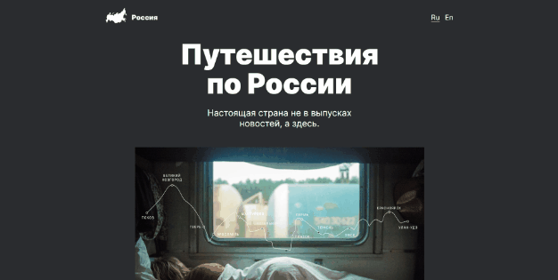

# Путешествие по России



### Ссылки:

<a href='https://dmitriy9427.github.io/russian-travel/index.html' target=_blank>Ссылка для просмотра.</a>

<a href="https://www.figma.com/file/5S2WSbEFL6awjVWJ0NWL8Q/Sprint-3_-Russia-_-desktop-%2B-mobile?type=design&node-id=28503-0&mode=design&t=kw7ovfAiClhQaonU-0">Ссылка на макет.</a>

### Описание:

Одностраничный, адаптивный сайт, который создан с использованием HTML5, CSS. Реализован по правилам flexbox, grid, используется CSS анимация, медиазапросы (для адаптивной верстки в диапазоне от 320px до 1440px), подключены шрифты. Файловая структура организована по Nested БЭМ. Проект где пользователи смогут найти красочные фотографии различных российских достопримечательностей, сопровождаемые краткими описаниями. Ссылки предоставляет информацию о различных направлениях путешествий по России. Каждая страница содержит описание места, фотографии и полезную информацию для путешественников Адаптивность: веб-сайт адаптируется под различные устройства, обеспечивая оптимальное отображение.

### Функционал:

- Плавность при наведении на ссылки.
- Увеличение масштаба картинки при наведении под главой "Чего мы там не видели?"
- Переход по ссылкам на другие страницы.

### Стек:

- HTML5 (семантическая верстка).

- CSS3
  - Flexbox.
  - Grid Layout.
  - @media-запросы.
  - BEM.
  - Позиционирование.

### Инструкция по установке:

Скачайте или склонируйте репозиторий:

```
git clone https://github.com/dmitriy9427/russian-travel.git
```

Перейдите в папку с репозиторием

```
cd ./russian-travel
```

Запустите редакторе кода (Visual Studio Code)

```
code .
```
